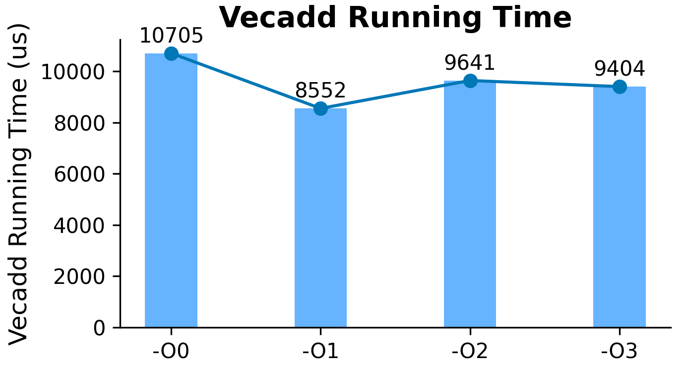
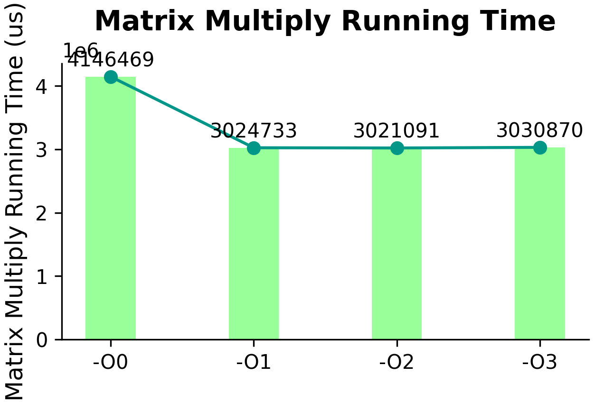
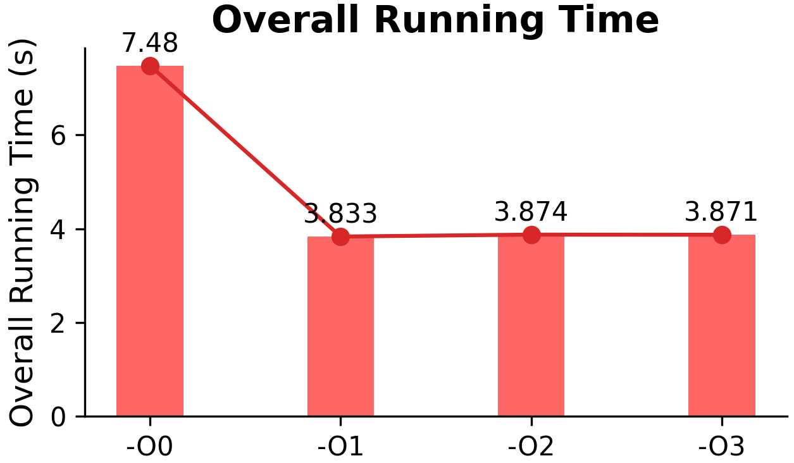

<center>

# Homework1

</center>
<center>

**孙皓宇**
**2025.03.09**

</center>

### 一、实验目的

本次实验旨在探究不同编译选项（-g -O0 -O1 -O2 -O3）对程序性能的影响，通过使用特定编译器对给定代码进行编译，并分析编译选项所采用的优化方法，深入理解编译优化的原理和效果。

### 二、实验环境

#### 1. **硬件环境**

- **CPU 型号：AMD Ryzen 5 5600H with Radeon Graphics**
- **内存：16G**

#### 2. **软件环境**

- **操作系统：Linux shy-Lenovo-Legion-R70002021 6.8.0-52-generic #53~22.04.1-Ubuntu SMP PREEMPT_DYNAMIC Wed Jan 15 19:18:46 UTC 2 x86_64 x86_64 x86_64 GNU/Linux（非虚拟机）**
- **编译器：gcc (Ubuntu 11.4.0-1ubuntu1~22.04) 11.4.0**

### 三、实验原理

#### 1. **编译选项简介**

- **-g**：该选项用于在编译时生成调试信息，方便后续调试程序，但会增加可执行文件的大小。
- **-O0**：表示不进行优化，编译器尽可能按照源代码的逻辑生成目标代码，生成的代码结构接近源代码，便于调试，但执行效率较低。
- **-O1**：进行基本优化，如常量折叠、死代码消除等，能在一定程度上提高程序执行效率。
- **-O2**：在 -O1 的基础上进行中度优化，包括循环展开、函数内联等，进一步提升程序性能。
- **-O3**：进行高度优化，可能包含自动向量化等高级优化技术，使程序运行速度更快，但编译时间可能会增加。

#### 2. **优化方法原理**

- **常量折叠**：在编译阶段计算常量表达式的值，而不是在运行时计算，减少运行时的计算开销。
- **死代码消除**：移除永远不会被执行的代码，减小可执行文件体积并提高执行效率。
- **循环展开**：将循环体展开，减少循环控制的开销，但可能会增加代码体积。
- **函数内联**：将函数调用替换为函数体代码，减少函数调用的开销，提高执行效率。
- **自动向量化**：利用现代 CPU 的 SIMD（单指令多数据）指令集，对数据进行并行处理，大幅提升计算密集型任务的执行速度。

### 四、实验过程

#### 1. **代码准备**

本次实验使用的代码 `homework1.cpp` 主要包含向量加法（`vecadd` 函数）、矩阵乘法（`SimpleMultiply` 和 `mydgemmtrans` 函数）以及计算圆周率（`mypi` 函数）等功能。代码通过 `GetUsec` 函数获取函数执行前后的时间戳，以计算函数执行时间。

#### 2. **编译过程**

使用编译器分别以 -g -O0、-g -O1、-g -O2、-g -O3 编译选项对 `homework1.cpp` 进行编译，生成对应的可执行文件。编译命令如下：

- `-O0` 无优化：`g++ -g -O0 homework1.cpp -o homework1_O0 -lopenblas`
- `-O1` 基本优化：`g++ -g -O1 homework1.cpp -o homework1_O1 -lopenblas`
- `-O2` 中度优化：`g++ -g -O2 homework1.cpp -o homework1_O2 -lopenblas`
- `-O3` 高度优化：`g++ -g -O3 homework1.cpp -o homework1_O3 -lopenblas`

其中 `-lopenblas` 是因为代码中使用了 BLAS 库的函数，需要链接该库。

#### 3. **运行时间记录**

- 运行每个生成的可执行文件，记录代码中各函数（`vecadd` 和 `SimpleMultiply`）输出的运行时间。同时，也可借助 `time` 命令记录整个程序的运行时间，以作参考。记录的数据如下表所示：

| 编译选项 | Vecadd 运行时间 (us) | Matrix Multiply 运行时间 (us) | 整体运行时间 (s)（time 命令结果） |
| -------- | -------------------- | ----------------------------- | --------------------------------- |
| -O0      | 10705                | 4146469                       | 7.480                             |
| -O1      | 8552                 | 3024733                       | 3.833                             |
| -O2      | 9641                 | 3021091                       | 3.874                             |
| -O3      | 9404                 | 3030870                       | 3.871                             |

</br>

#### 4. **优化方法分析过程**

- **使用 `-fopt-info` 选项**：在编译时添加 `-fopt-info` 选项，获取编译器在不同优化级别下所采用的优化方法信息。例如：
  - `g++ -g -O1 -fopt-info homework1.cpp -o homework1_O1 -lopenblas`
  - `g++ -g -O2 -fopt-info homework1.cpp -o homework1_O2 -lopenblas`
  - `g++ -g -O3 -fopt-info homework1.cpp -o homework1_O3 -lopenblas`
- 分析这些输出信息，总结不同优化级别下使用的优化方法。
- **结合汇编代码分析**：生成不同优化级别的汇编代码文件，命令如下：
  - `g++ -g -O0 -S homework1.cpp -o homework1_O0.s -lopenblas`
  - `g++ -g -O1 -S homework1.cpp -o homework1_O1.s -lopenblas`
  - `g++ -g -O2 -S homework1.cpp -o homework1_O2.s -lopenblas`
  - `g++ -g -O3 -S homework1.cpp -o homework1_O3.s -lopenblas`
- 使用文本编辑器打开汇编文件，对比不同优化级别下汇编代码的差异，从代码结构、指令使用等方面分析优化效果。例如，观察是否存在循环展开导致代码量增加、寄存器使用是否更高效等情况。

### 五、实验结果分析

#### **1. 运行时间分析**

- 根据记录的运行时间数据，绘制图表（，展示不同编译选项下各函数的运行时间变化趋势。分析图表可知，随着优化级别的提高，函数的运行时间整体呈下降趋势。其中，从 -O0 到 -O1 的优化效果较为明显，这主要是由于 -O1 进行了基本的优化操作，减少了一些不必要的计算和代码执行。从 -O1 到 -O2、-O3 的优化效果逐渐减小，因为高级优化技术在提升性能的同时，可能受到硬件特性、代码结构等因素的限制。

<div style="display: flex; justify-content: space-around;">



</div>
</br>

#### **2. 优化方法分析**

以下是根据不同编译选项下的 `g++ -fopt-info` 输出信息，对不同优化级别使用的优化方法进行的分析：

##### -O1 优化级别

```c
   homework1.cpp:96:9: optimized:   Inlining int printf(const char*, ...)/349 into int main(int, char**)/581 (always_inline).
   homework1.cpp:81:9: optimized:   Inlining int printf(const char*, ...)/349 into int main(int, char**)/581 (always_inline).
   homework1.cpp:66:9: optimized:   Inlining int printf(const char*, ...)/349 into int main(int, char**)/581 (always_inline).
```

- **优化方法**：函数内联（Function Inlining）
  - **解释**：编译器将 `printf` 函数调用直接替换为 `printf` 函数体的代码。这是因为 `printf` 函数可能被标记为 `always_inline`，编译器为了减少函数调用的开销，如栈帧的创建和销毁、参数传递等，将其直接嵌入到调用处。函数内联可以提高程序的执行效率，特别是对于一些短小的函数调用。

##### -O2 优化级别

```c
   homework1.cpp:96:9: optimized:   Inlining int printf(const char*, ...)/349 into int main(int, char**)/581 (always_inline).
   homework1.cpp:81:9: optimized:   Inlining int printf(const char*, ...)/349 into int main(int, char**)/581 (always_inline).
   homework1.cpp:66:9: optimized:   Inlining int printf(const char*, ...)/349 into int main(int, char**)/581 (always_inline).
   homework1.cpp:64:9: optimized:  Inlining int vecadd(double*, double*, double*, size_t)/577 into int main(int, char**)/581.
   homework1.cpp:98:1: optimized:  Inlined __static_initialization_and_destruction_0.constprop/1223 into (static initializers for homework1.cpp)/1208 which now has time 3.651584 and size 9, net change of -6.
```

- **优化方法**：
  - **函数内联（Function Inlining）**：除了继续对 `printf` 函数进行内联外，还将 `vecadd` 函数内联到 `main` 函数中。这进一步减少了函数调用的开销，提高了代码的执行效率。
  - **静态初始化和销毁函数内联**：将 `__static_initialization_and_destruction_0` 函数内联到静态初始化代码中，使得静态初始化部分的代码时间和大小都有所减少，可能是通过消除一些不必要的函数调用和代码冗余实现的。

##### -O3 优化级别

```c
   homework1.cpp:96:9: optimized:   Inlining int printf(const char*, ...)/349 into int main(int, char**)/581 (always_inline).
   homework1.cpp:81:9: optimized:   Inlining int printf(const char*, ...)/349 into int main(int, char**)/581 (always_inline).
   homework1.cpp:66:9: optimized:   Inlining int printf(const char*, ...)/349 into int main(int, char**)/581 (always_inline).
   homework1.cpp:95:17: optimized:  Inlining double mypi()/580 into int main(int, char**)/581.
   homework1.cpp:80:19: optimized:  Inlining int64_t GetUsec()/576 into int main(int, char**)/581.
   homework1.cpp:78:18: optimized:  Inlining int64_t GetUsec()/576 into int main(int, char**)/581.
   homework1.cpp:65:26: optimized:  Inlining int64_t GetUsec()/576 into int main(int, char**)/581.
   homework1.cpp:64:9: optimized:  Inlining int vecadd(double*, double*, double*, size_t)/577 into int main(int, char**)/581.
   homework1.cpp:63:25: optimized:  Inlining int64_t GetUsec()/576 into int main(int, char**)/581.
   homework1.cpp:98:1: optimized:  Inlining void __static_initialization_and_destruction_0(int, int)/1089 into (static initializers for homework1.cpp)/1208.
   homework1.cpp:15:23: optimized: loop vectorized using 16 byte vectors
   homework1.cpp:15:23: optimized:  loop versioned for vectorization because of possible aliasing
   homework1.cpp:15:23: optimized: loop turned into non-loop; it never loops
   homework1.cpp:38:27: optimized: loop vectorized using 16 byte vectors
   homework1.cpp:38:27: optimized: loop turned into non-loop; it never loops
   homework1.cpp:15:23: optimized: loop vectorized using 16 byte vectors
```

- **优化方法**：

  - **函数内联（Function Inlining）**：继续对多个函数进行内联，包括 `mypi`、`GetUsec` 等函数，尽可能减少函数调用的开销，提高代码的局部性和执行效率。
  - **循环向量化（Loop Vectorization）**：编译器将某些循环使用 16 字节向量进行向量化处理。向量化是利用现代 CPU 的 SIMD（单指令多数据）指令集，同时对多个数据元素进行操作，从而提高循环的执行效率。例如，在处理数组元素时，可以一次处理多个元素，而不是逐个处理。
  - **循环版本化（Loop Versioning）**：由于可能存在内存别名（Aliasing）问题，编译器对循环进行版本化处理。内存别名是指多个指针可能指向同一块内存地址，这会影响向量化的正确性。编译器通过生成不同版本的循环代码，在有别名和无别名的情况下分别执行，以保证代码的正确性和性能。
  - **循环消除（Loop Elimination）**：将一些实际上不会循环的循环转换为非循环代码。编译器通过分析循环条件，发现循环只会执行一次或根本不会执行，从而将循环结构消除，减少了循环控制的开销。

  综上所述，随着优化级别的提高，编译器采用的优化方法越来越多，越来越复杂，旨在进一步提高程序的执行效率。

### 六、实验总结

1. **实验结论**
   - 不同编译选项对程序性能有显著影响。随着优化级别的提高，程序的运行时间逐渐减少，但编译时间可能会增加。
   - 编译器在不同优化级别下采用了多种优化方法，如常量折叠、死代码消除、循环展开、函数内联和自动向量化等，这些优化方法在不同程度上提高了程序的执行效率。
   - 在实际应用中，应根据具体需求选择合适的编译选项。如果注重程序的调试便利性，可选择 -O0 或 -g 选项；如果追求程序的高性能，可选择较高的优化级别，但需考虑编译时间和可能出现的兼容性问题。
2. **实验收获与不足**
   - **收获**：通过本次实验，深入了解了编译优化的原理和方法，掌握了如何使用编译器选项对程序进行优化，并学会了通过分析运行时间和汇编代码来评估优化效果。这对于提高程序性能和编写高效的代码具有重要的指导意义。
   - **不足**：在实验过程中，发现某些优化方法的效果难以直观地从汇编代码中分析出来，需要进一步学习和研究汇编语言的相关知识。此外，对于一些复杂的优化技术，如自动向量化，其效果受到多种因素的影响，需要更深入地了解硬件架构和算法特性，才能更好地发挥其优势。在后续的学习中，将继续加强对这些方面的学习和实践。
